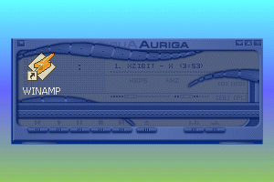

<div align="center">

## Make any Window Transparent\(Re\-Submit\)


</div>

### Description

Make any windows transparent with this code! Includes two options : "Mouse" were you point your mouse at a window title and it can become transparent. Then there is the "ComboBox" thing were you can select a window from a combobox and make it transparent. By the way this code only WORKS UNDER WINDOWS 2000!
 
### More Info
 
Windows 2000

May make some windows transparent.


<span>             |<span>
---                |---
**Submitted On**   |2000-12-06 16:07:04
**By**             |[RAM](https://github.com/Planet-Source-Code/PSCIndex/blob/master/ByAuthor/ram.md)
**Level**          |Advanced
**User Rating**    |3.8 (15 globes from 4 users)
**Compatibility**  |VB 6\.0
**Category**       |[Miscellaneous](https://github.com/Planet-Source-Code/PSCIndex/blob/master/ByCategory/miscellaneous__1-1.md)
**World**          |[Visual Basic](https://github.com/Planet-Source-Code/PSCIndex/blob/master/ByWorld/visual-basic.md)
**Archive File**   |[CODE\_UPLOAD124071262000\.zip](https://github.com/Planet-Source-Code/ram-make-any-window-transparent-re-submit__1-13386/archive/master.zip)

### API Declarations

```
If you like this code then
Vote Exelent
Else
don't view my other submitions
end if
```


